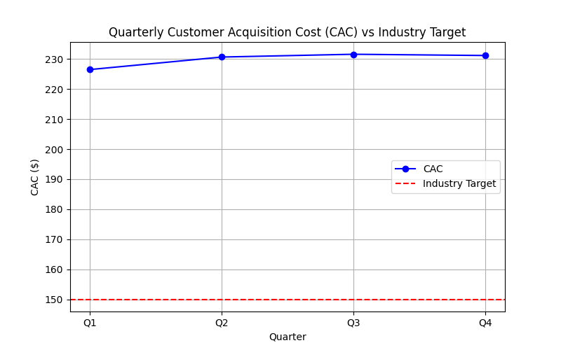

# Quarterly CAC Analysis - 2024

**Email for verification:** 22f3000814@ds.study.iitm.ac.in
Hello

## Dataset

Customer Acquisition Cost (CAC) for 2024:

| Quarter | CAC ($) |
|---------|---------|
| Q1      | 226.49  |
| Q2      | 230.66  |
| Q3      | 231.59  |
| Q4      | 231.17  |

**Average CAC:** 229.98  
**Industry Target CAC:** 150

## Key Findings

1. The CAC has slightly increased from Q1 (226.49) to Q3 (231.59), then slightly decreased to Q4 (231.17).
2. The average CAC (229.98) is **significantly higher than the industry target of 150**, indicating inefficiency in customer acquisition.
3. The trend shows a stable but high CAC across all quarters.

## Business Implications

- High CAC reduces profitability and ROI for marketing campaigns.
- Remaining above the industry benchmark may hinder competitive positioning.
- Without intervention, marketing spend is less efficient than peers in the industry.

## Recommendations

**Solution:** Optimize digital marketing channels

1. Audit marketing channels to identify the highest cost-per-acquisition sources.
2. Reallocate budget to high-performing channels with lower CAC.
3. Improve targeting, messaging, and automation to reduce waste.
4. Experiment with A/B testing for campaigns to improve efficiency.
5. Consider partnerships or referral programs to lower acquisition costs.

Following these steps can move the CAC closer to the industry target of 150.

## Visualization

